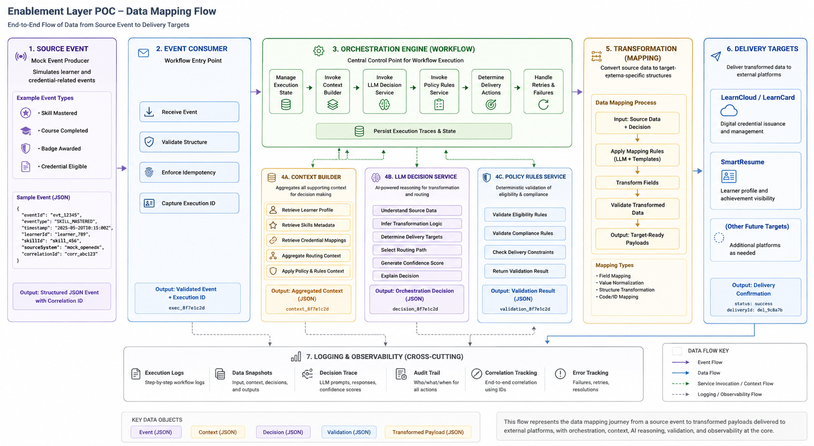

# **Skills Mobility Infrastructure Proof of Concept (POC) Requirements**

_Diagram: [Enablement Layer POC — Data Mapping Flow](../3_design/architecture/enablement-layer-data-mapping-flow.png)_

## **Context**

The purpose of this document is to define the requirements, scope, assumptions, and success criteria for a Proof of Concept (POC) focused on AI-assisted credential orchestration, transformation, and delivery using LLMs and Model Context Protocol (MCP).

The POC will validate whether an orchestration-centric architecture can:

* Interpret learner and credential events  
* Determine the correct routing and transformation actions  
* Reliably leverage LLM reasoning for orchestration decisions  
* Utilize MCP as a standardized interface layer for data access and tooling  
* Deliver transformed learner credential data to downstream systems

The POC is intentionally limited in scope and is not intended to represent the full production architecture. Instead, it is intended to validate key technical assumptions and identify implementation risks before broader investment.

The long-term target architecture includes event-driven orchestration, policy validation, context aggregation, MCP-based integrations, routing logic, audit logging, and external delivery adapters.

## **Scope and Definitions**

### **Scope**

The scope of this POC includes:

* Mock generation of learner and credential-related events  
* Mock learner and skills data APIs  
* An orchestration workflow engine capable of processing incoming events  
* Context aggregation for orchestration decisions  
* Use of an LLM for transformation and routing reasoning  
* Use of MCP interfaces for accessing supporting data and tools (where appropriate)  
* Delivery of transformed data to:  
  * LearnCloud/LearnCard  
  * SmartResume  
* Logging of orchestration decisions and delivery actions  
* Validation of confidence scoring and orchestration outputs

### **Out of Scope**

The following items are out of scope for the POC:

* Production-ready Open edX eventing infrastructure  
* Production learner profile APIs  
* Full policy engine implementation  
* Multi-tenant deployment concerns  
* Advanced governance and compliance workflows  
* Production-scale observability and monitoring  
* Human review workflows  
* Complex workflow branching and exception handling

### **Definitions**

**Credential Event:** A learner-related activity or achievement notification that may require orchestration, transformation, or delivery actions.

**Context Builder:** A service responsible for aggregating learner, skill, policy, and workflow context required for orchestration decisions.

**Delivery Target:** An external platform that receives transformed learner credential data.

**LLM Decision Service:** A service that uses a large language model to determine routing, transformation, or orchestration actions.

**MCP (Model Context Protocol):** A standardized interface for exposing tools, resources, and data services to AI systems.

**Orchestration Engine:** The workflow runtime responsible for coordinating event processing, context retrieval, decision execution, validation, and delivery.

**Policy Rules Service:** A deterministic validation service responsible for enforcing eligibility and compliance rules.

**Transformation:** The process of converting source learner or credential data into a target-system-specific structure.

**Workflow Execution:** The end-to-end processing lifecycle, beginning with event ingestion and ending with successful delivery or error handling.

# **POC Objectives**

The primary objectives of the POC are to validate the following:

## **Objective 1: Orchestration Engine Responsibilities**

Determine what responsibilities must be handled deterministically within the orchestration layer versus delegated to LLM reasoning.

Key validation questions:

* What workflow state management is required?  
* What orchestration steps must remain deterministic?  
* How should the execution context be passed between services?  
* What level of workflow visibility and traceability is required?

## **Objective 2: LLM-Based Transformation and Routing**

Evaluate the ability of an LLM to:

* Understand source learner and credential data structures  
* Infer appropriate transformation logic  
* Determine appropriate delivery targets  
* Select the correct routing path  
* Generate confidence scores for decisions  
* Explain orchestration decisions

Key validation questions:

* How accurate are LLM transformation outputs?  
* How consistent are routing decisions?  
* What confidence thresholds are acceptable?  
* Where are deterministic fallbacks required?  
* What prompt engineering strategies are necessary?

# **Architectural Scope**

## **Included Components**

The following components are in scope for the POC.

### **Mock Event Producer**

A mock event source will simulate learner and credential-related events that would eventually originate from Open edX (or other source system).

Example event types:

* Skill mastered  
* Course completed  
* Badge awarded  
* Credential eligible

The mock event producer must:

* Generate structured JSON events  
* Support configurable test scenarios  
* Support replay of events  
* Include correlation identifiers

### **Event Consumer**

The event consumer will serve as the workflow entry point.

Responsibilities:

* Receive incoming events  
* Validate message structure  
* Enforce idempotency  
* Initiate workflow execution  
* Capture execution identifiers

### **Workflow / Orchestration Engine**

The orchestration engine is the central control point for workflow execution. This could be a true orchestration engine or an AI agent with a goal of message delivery

Responsibilities:

* Coordinate orchestration steps  
* Manage execution state  
* Invoke context aggregation  
* Invoke LLM reasoning  
* Invoke policy validation  
* Determine delivery actions  
* Handle retries and failures  
* Persist execution traces

The orchestration engine must support:

* Event-driven execution  
* Step-based workflow orchestration  
* Configurable workflow definitions  
* Retry handling  
* Timeout handling  
* Structured execution logging

### **Context Builder**

The context builder will aggregate all supporting information required for orchestration decisions.

Responsibilities:

* Retrieve learner profile data  
* Retrieve skills metadata  
* Retrieve credential mappings  
* Aggregate routing context  
* Aggregate policy context  
* Provide a normalized decision context

The context builder may retrieve information through MCP or other interfaces.

### **LLM Decision Service**

The LLM Decision Service will evaluate orchestration context and generate routing and transformation decisions.

Responsibilities:

* Determine delivery targets  
* Determine transformation mappings  
* Determine workflow actions  
* Generate structured orchestration outputs  
* Generate confidence scores  
* Provide decision rationale

The LLM must return structured outputs, including:

* Selected delivery targets  
* Transformation instructions  
* Confidence score  
* Explanation or rationale  
* Error conditions

### **MCP Client Layer**

The MCP layer will standardize access to tools and data providers.

Responsibilities:

* Discover MCP resources  
* Invoke MCP tools

The POC should validate:

* MCP usability  
* Tool discovery patterns  
* Prompt construction strategies using MCP metadata  
* Performance implications of MCP usage

### **Policy Rules Service**

The policy service will perform deterministic validation.

Responsibilities:

* Validate eligibility rules  
* Validate required fields  
* Validate routing constraints  
* Validate transformation outputs  
* Reject invalid delivery actions

The policy service must remain deterministic and must not rely on LLM interpretation.

### **Delivery Routing Service**

The delivery routing service will determine which downstream integrations should receive transformed data.

Responsibilities:

* Route transformed payloads  
* Support multiple delivery targets  
* Handle delivery failures  
* Record delivery outcomes

### **Audit Logging**

The system must maintain audit records for orchestration decisions.

The audit log must capture:

* Event identifiers  
* Workflow identifiers  
* Transformation outputs  
* Routing decisions  
* LLM confidence scores  
* Delivery results  
* Error conditions

# **Success Criteria**

The POC will be considered successful if it demonstrates:

## **Orchestration Success Criteria**

* Reliable end-to-end workflow execution  
* Successful event correlation and tracking  
* Clear workflow visibility and traceability

## **LLM Success Criteria**

* Accurate transformation recommendations  
* Accurate routing decisions  
* Consistent structured outputs  
* Explainable orchestration reasoning  
* Acceptable confidence scoring behavior

## **Integration Success Criteria**

* Successful delivery to LearnCloud/LearnCard  
* Successful delivery to SmartResume  
* Successful audit logging of all execution steps
