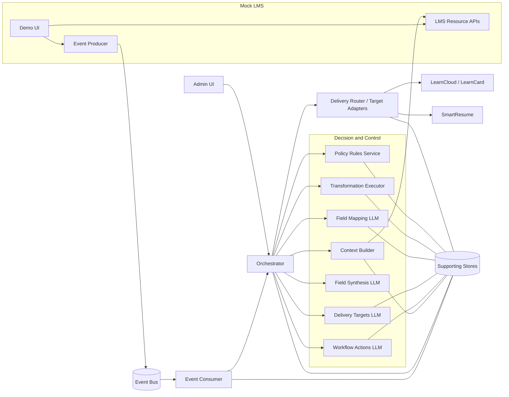

# Target POC Architecture

Status: Draft
Date: 2026-06-19
Related: [Phase 2 POC Slice](../../2_requirements/phase-2-poc-slice.md) · [Stakeholder POC Requirements](../../2_requirements/poc-requirements.md) · [Target POC Requirements](../../2_requirements/target-poc-requirements.md) · [POC Component Boundary Matrix](../poc-component-boundaries.md) · [ADR-0007](../../decisions/0007-llm-decision-service-decomposition.md) · [ADR-0008](../../decisions/0008-transformation-mapping-service-decomposition.md) · [ADR-0009](../../decisions/0009-workflow-actions-orchestration-model.md) · [ADR-0011](../../decisions/0011-orchestration-runtime-technology.md) · [ADR-0012](../../decisions/0012-mcp-client-layer-deferred.md) · [ADR-0013](../../decisions/0013-llm-decision-service-testing-approach.md) · [ADR-0015](../../decisions/0015-orchestrator-execution-model.md) · [ADR-0017](../../decisions/0017-three-transformation-phases.md) · [ADR-0021](../../decisions/0021-llm-testing-tooling-extensions.md)

## 1. Purpose

This is the canonical high-level architecture diagram for the current POC.

Use this document together with the [POC Component Boundary Matrix](../poc-component-boundaries.md) and [Target POC Requirements](../../2_requirements/target-poc-requirements.md): the PNG below is the primary visual reference for the current target architecture, while the boundary matrix remains the detailed source of truth for ownership, non-ownership, dependencies, and logical stores. The original stakeholder baseline is preserved separately in [POC Requirements](../../2_requirements/poc-requirements.md).

## 2. Primary Diagram

_Diagram: [whiteboard-target-poc-architecture.png](./whiteboard-target-poc-architecture.png)_

## 3. Simplified Overview

The overview below is intentionally smaller than the PNG. It shows the major runtime boundaries and critical flows only.

## 4. Notes

- The PNG is the primary visual reference for the current target architecture.
- The Mermaid overview is intentionally compressed; the [POC Component Boundary Matrix](../poc-component-boundaries.md) remains the source of truth for exact component names, boundaries, and logical stores.
- The **Admin UI** reads a unified execution view from the **Orchestrator** rather than querying every backend service directly.
- The **Policy Rules Service** remains the deterministic validation boundary between LLM outputs and downstream delivery.
- The **MCP Client Layer** is intentionally absent from this diagram because it is deferred from the initial POC scope by [ADR-0012](../../decisions/0012-mcp-client-layer-deferred.md).
- `Supporting Stores` in the Mermaid overview stands in for the stores called out individually in the boundary matrix, including idempotency, execution logs, policy, mapping templates, badge templates, delivery targets, validated plans, and source fetch rules.

### Current implementation status (vs. this target)

This diagram is the **target**. As of the Phase 2 slice (see [Phase 2 POC Slice](../../2_requirements/phase-2-poc-slice.md)), the build differs from the target as follows:

- **Policy Rules Service** is not built as a separate service. Its validation boundary is currently satisfied by **per-service structural self-validation** (each Decision Service and the Transformation Executor gate their own output) plus the Orchestrator's deterministic **plan executor** — the LLM's plan is re-bound to executor bindings when executable and otherwise falls back to the deterministic plan, so no unvalidated LLM output reaches delivery.
- The **Transformation Executor** now exists as a standalone deterministic service that runs the Field Mapping JSONata against the merged source + synthesized context (ADR-0017 phases).
- Cross-service artifact handoffs are **inline** (each service owns its own store); the Mermaid `Supporting Stores` node is a logical grouping, not a shared store.
- A **decision evaluation harness** (ADR-0013 / ADR-0021) scores the Decision Services against a frozen labelled corpus.
- Infrastructure-as-code is **CloudFormation** (revised from CDK) provisioning **Lambda** (ADR-0015); see the ADR-0003 infrastructure revision.
